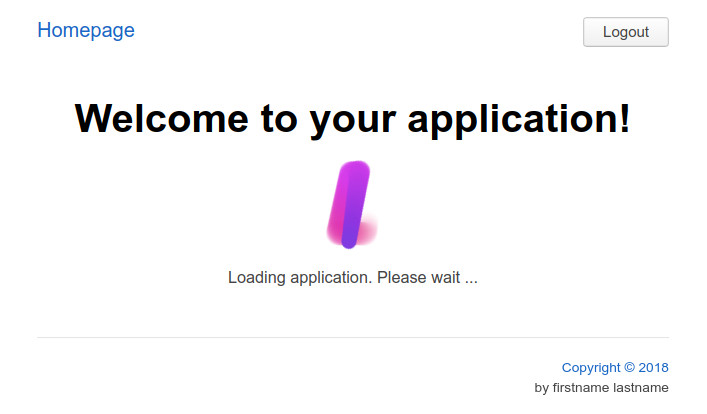

**Please note that this project is not under active development. Writing a react application with Kotlin
and ring-ui turned out to be rather unproductive. Too many roadblocks and things to implement in infrastructure before
the actual application can be implemented. Also, the file size of the production app is too large to be useful.**

# Kotlin wrappers for ring-ui

This library is easy to use with https://github.com/JetBrains/create-react-kotlin-app .
It's split into one npm module per ring-ui component because kotlin-js isn't supporting more than one
module per project.

## Quickstart



### Create your project
```bash
npm install create-react-kotlin-app
npx create-react-kotlin-app my-app
cd my-app
npm install --save "@logrally/kotlin-react-ring-ui"
npm run gen-idea-libs
```

### Patch your build configuration
See https://youtrack.jetbrains.com/issue/CRKA-85#comment=27-2957370 for details
how you need to configure your build configuration.

Apply the changes to these files:
- `node_modules/react-scripts-kotlin/config/webpack.config.dev.js`
- `node_modules/react-scripts-kotlin/config/webpack.config.prod.js`

### Add npm dependencies

There's one npm module per ring-ui component. See https://www.npmjs.com/search?q=kotlin-ring-ui for the available modules.
An unfinished application with a working base setup is available at https://github.com/Logrally/logrally-web.

For example:

```npm install --save @logrally/kotlin-ring-ui-shared @logrally/kotlin-ring-ui-alert```

### Run your application in development mode

`npm run build`

### Update your source code

Update the file `src/app/App.kt` with this and wait until the page in the browser was reloaded.

```kotlin
package app

import react.*
import react.dom.div
import react.dom.h1
import ringui.authdialog.authDialog
import ringui.button.button
import ringui.footer.FooterLineData
import ringui.footer.copyright
import ringui.footer.footer
import ringui.header.header
import ringui.header.tray
import ringui.link.link
import ringui.loader.loader

interface AppState : RState {
    var showLogin: Boolean
    var loggedIn: Boolean
}

class App : RComponent<RProps, AppState>() {
    override fun RBuilder.render() {
        header {
            link(title = "Homepage", href = "/")

            tray {
                if (state.loggedIn == true) {
                    button("Logout") {
                        attrs.onClick = {
                            setState { loggedIn = false }
                        }
                    }
                }
                else {
                    button("Login") {
                        attrs.onClick = {
                            setState { showLogin = true }
                        }
                    }
                }
            }
        }

        div {
            authDialog(serviceName = "ACME Inc.", show = state.showLogin) {
                attrs.onConfirm = {
                    setState { showLogin = false; loggedIn = true }
                }
            }

            if (state.loggedIn) {
                h1 { +"Welcome to your application!" }
                loader("Loading application. Please wait ...")
            }
        }

        footer {
            attrs.right = arrayOf(FooterLineData(copyright(2018), "/"), "by firstname lastname")
        }
    }
}

fun RBuilder.app() = child(App::class) {}
```

# Building
```bash
npm install
gradle clean build
```

# License

Licensed under the MIT license.